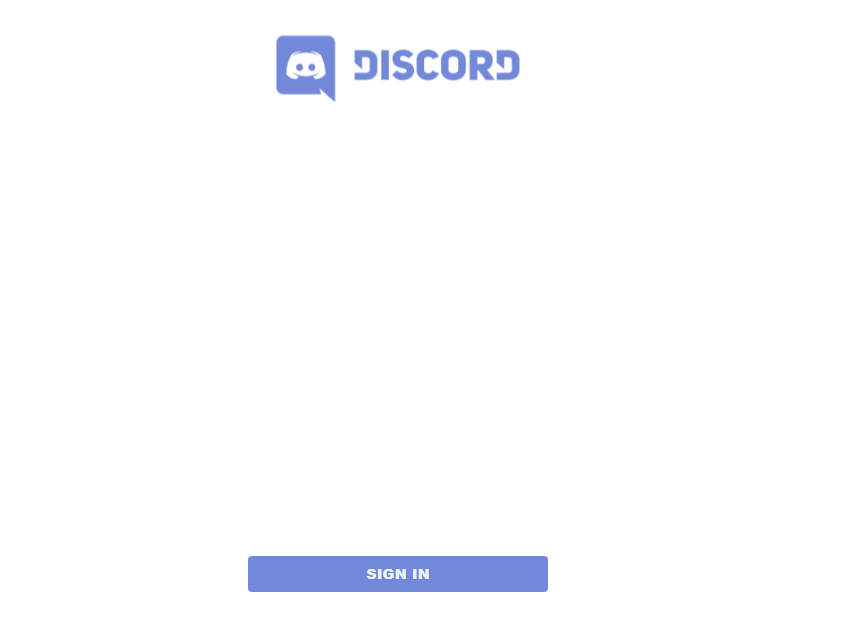
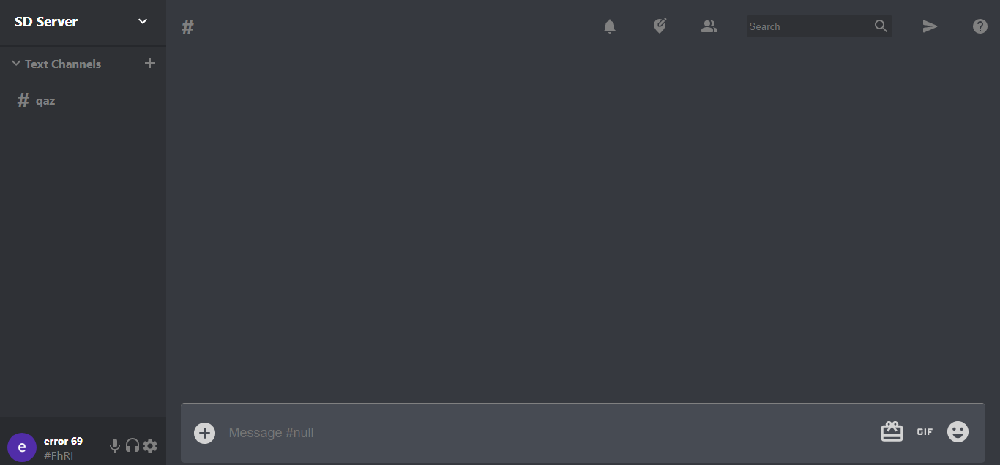

# React Discord Clone

> Functional Discord Clone using React and Firebase.

Login

## Features

Implemented Features

- [x] Real time messaging
- [x] Authentication (Gmail)
- [x] Loads User Data upon login (Server, Channels, Private Messages)
- [x] Channel Settings (Change name and delete)
- [x] Persistent channel history
- [x] Timestamps for messages

Working on

- [x] Creation and Joining Servers
- [x] Creation of Channels in a Server
- [x] Server Settings (Change name and delete)
- [x] Show current active users in given server
- [x] Voice Chat
